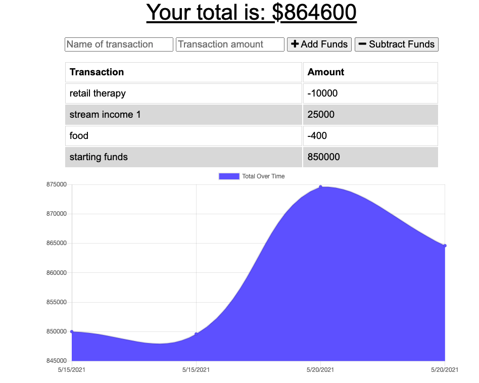

# budget-tracker

https://sprinkles-budget-tracker.herokuapp.com/

## Mock Up



## Table of Contents 

- [Mock Up](#mock-up)
- [Description](#description)
- [User Story](#user-story)
- [Installation](#installation)
- [Usage](#usage)
- [Contributing](#contributing)
- [Questions](#questions)
## Description 
```
I built an application that gives users a fast and easy way to track their money. This app allows the user access to their information at any time, which is important to users when offline. Having offline functionality is paramount to the success of an application that handles users’ financial information. The user will be able to add expenses and deposits to their budget with or without a connection. If the user enters transactions offline, the total will be updated when they're brought back online.

```
## User Story 
```
AS AN avid traveler
I WANT to be able to track my withdrawals and deposits with or without a data/internet connection
SO THAT my account balance is accurate when I am traveling 
```
## Installations 
`npm init`<br />
`npm install compression`<br />
`npm install express`<br />
`npm install mongoose`<br />
`npm install morgan`<br />
## Usage
```
Ability to view, add, remove expenses and deposits to their budget meanwhile being online or offline. 
```
## Contributions

[Jennifer](https://github.com/cleanjenn)

## Questions 

Feel free to contact me via email: <br /> [Email](mailto:jennifer23gomez7@gmail.com)<br /> 
[Github](https://github.com/cleanjenn)<br />